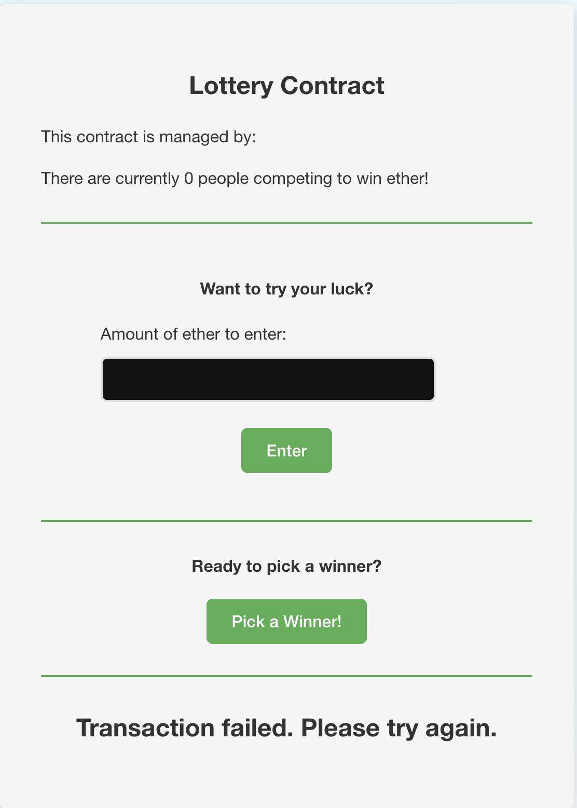

# Smart Contracts in Ethereum and Solidity

Repository that contains different smart contracts using solidity and ethereum.

1. Inbox contract :- A user can call the message over blockchain. Also user can change the current message to some other message by paying some gas fees and minimum ether.
2. Lottery Contract :- Participants can enter the lottery by sending a specified amount of Ether to the contract. Once enough participants have entered, the contract owner (manager) can choose a random winner who will receive the entire pool of Ether.

## Screenshot of working app



## Dependency | Tech Used

- Remix
- Metamask
- Truffle
- Ganache
- Solidity/Ethereum
- Mocha

## Getting Started

1. Install Truffle globally:

```bash
npm install -g truffle
```

2. Clone the repository and navigate to the project directory:

```bash
git clone https://github.com/yourusername/lottery-smart-contract.git
cd lottery-smart-contract
```

3. Install the required dependencies:

```bash
npm install
```

4. Run Ganache to start a local Ethereum network:

```bash
ganache-cli
```

5. Compile the smart contracts:

```bash
truffle compile
```

6. Deploy the smart contracts:

```bash
truffle migrate
```

## Testing

Run the test suite by executing:

```bash
cd Inbox
npm run test
cd lottery
npm run test
```

## Deploying to a live network

In the deploy.js file change the following configs

```json
{
  "mnemonic": "YOUR_MNEMONIC_HERE",
  "infuraKey": "YOUR_INFURA_KEY_HERE"
}
```

After updating the configuration, run the following command to deploy to the live network:

```bash
node deploy.js
```
